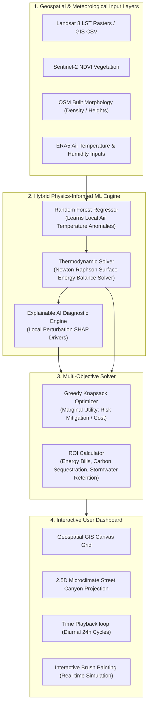
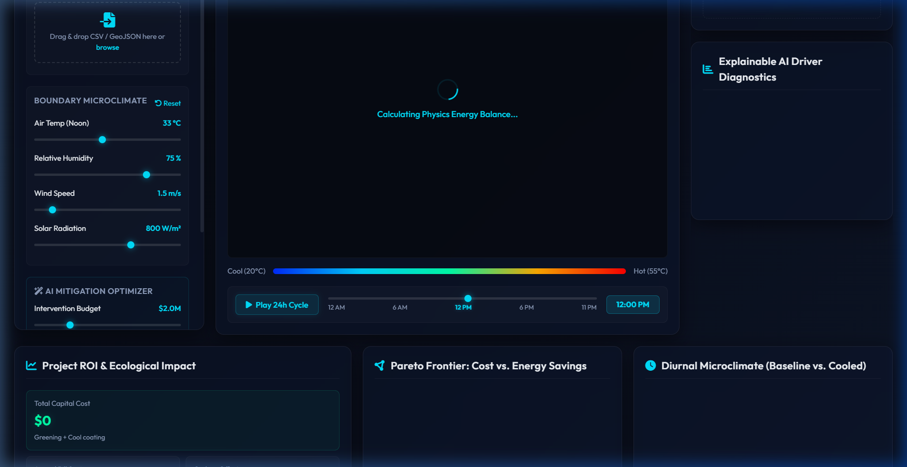
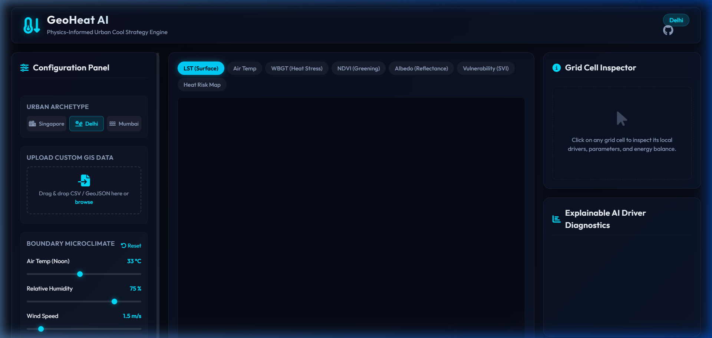

# GeoHeat AI: Urban Heat Mitigation & Cooling Strategy Engine

GeoHeat AI is a geospatial, physics-informed Artificial Intelligence and Machine Learning (AIML) framework designed to identify urban heat stress hotspots, quantify microclimatic warming drivers, and generate optimized cooling interventions (urban greening and cool roofs) under capital budget constraints.

---

## 🗺️ System Architecture & Workflow

The system bridges data-driven machine learning models with rigorous thermodynamic laws to guarantee physically consistent simulations.

### 🔄 System Flow Diagram



---

## 🔬 Core Meteorological Physics Formulas

### 1. Surface Energy Balance Equation
At the land-atmosphere boundary, energy conservation is strictly enforced:
$$R_n - H - LE - G = 0$$

Where:
- **Net Radiation ($R_n$)**: Combines albedo ($\alpha$), solar radiation ($S_{\downarrow}$), downward longwave atmospheric emissions ($L_{\downarrow}$), and surface thermal radiation:
  $$R_n = (1 - \alpha) S_{\downarrow} + L_{\downarrow} - \epsilon_s \sigma T_s^4$$
- **Sensible Heat Flux ($H$)**: Convective heat exchange driven by aerodynamic resistance ($r_a$), accounting for building canyon friction and displacement heights ($z_{\text{disp}}$):
  $$H = \rho c_p \frac{T_s - T_a}{r_a}$$
- **Latent Heat Flux ($LE$)**: Transpirative cooling driven by local vegetation cover (NDVI) and air dryness:
  $$LE = NDVI \cdot \text{PET} \cdot (1 - RH)$$
- **Ground Heat Storage ($G$)**: Diurnal heat storage during peak noon and thermal release at night:
  $$G = \mu \cdot R_n \cdot \cos\left(\frac{(t - 12)\pi}{12}\right)$$

---

## 📂 Repository Structure

```
├── backend/
│   ├── data_manager.py     # Grid generation and CSV/GeoJSON GIS file parsers
│   ├── physics.py          # Newton-Raphson SEB solver, aerodynamic resistances, and WBGT Comfort indexes
│   ├── model.py            # RandomForest microclimate calibration and driver attributions
│   ├── roi_calculator.py   # Computes energy savings, carbon captures, and treatment benefits
│   ├── optimizer.py        # Multi-objective Greedy Knapsack optimizer and Pareto frontiers
│   ├── main.py             # FastAPI REST endpoints and static file hosting
│   └── tests/
│       └── test_core.py    # Unit tests for solvers, models, and optimization bounds
├── frontend/
│   ├── index.html          # Slate-dark glassmorphic control layout
│   ├── style.css           # Glowing panels, hover states, and wind corridor keyframes
│   └── app.js              # RequestAnimationFrame particles, painting brushes, and diurnal loops
├── requirements.txt        # Backend dependencies
├── run_tests.py            # Standalone test runner (independent of pytest)
└── README.md               # User guide and architectural blueprint
```

---

## ⚡ Setup & Installation

### Prerequisites
- Python 3.10 or higher
- pip package manager

### 1. Clone the repository and navigate to the project root:
```bash
git clone <your-repository-url>
cd isro-project
```

### 2. Install dependencies:
```bash
pip install -r requirements.txt
```

### 3. Run the automated test suite to verify physical conservation laws:
```bash
python run_tests.py
```

### 4. Launch the local FastAPI application server:
```bash
python -m uvicorn backend.main:app --host 127.0.0.1 --port 8000
```

### 5. Access the Web Dashboard:
Open your browser and navigate to:
**`http://127.0.0.1:8000/`**

---

## 💡 How to Use the Interactive Dashboard

1. **Microclimate Profiler**: Select from tropical coastal, arid inland, or dense high-rise archetypes in the sidebar. Click **"Reset"** to return boundary parameters to defaults.
2. **Custom GIS Upload**: Drag and drop a GIS CSV containing `lat`, `lon`, `ndvi`, `albedo`, and `building_density` columns to load your own city mapping layout.
3. **Interactive Paint Brushes**: Select the **"Green Brush"** or **"Cool Roof Brush"** from the canvas toolbar, click-and-drag paint directly onto the map to visually inspect temperatures drop in real time.
4. **Wind Corridor Flow Toggle**: Turn on **"Wind Flow"** to animate particles showing how wind streams are guided through canals or blocked by tall buildings.
5. **AI Optimizer**: Specify a dollar budget limit and strategy (Physical Cooling, Social Heat Equity, or Balanced), click **"Run AI Optimizer"** to solve for the optimal strategic spatial placement. Click nodes on the **Pareto Frontier chart** to change budget levels.

---

## 📷 Visual Walkthrough & Screenshots

### 1. Interactive Heat Mitigation Dashboard
Deep-slate dark interface displaying LST (Surface) coordinate heatmaps alongside microclimate profile boundary selectors.


### 2. Grid Cell Inspector & Explainable AI
Clicking cells plots local driver attributions (SHAP contributions) and updates the animated 2.5D street canyon model dynamically.


### 3. Arid Microclimates & Urban Heat Susceptibility
Toggling alternate profiles (e.g. Delhi) to analyze thermal impacts under low humidity and extreme solar radiational forcings.

